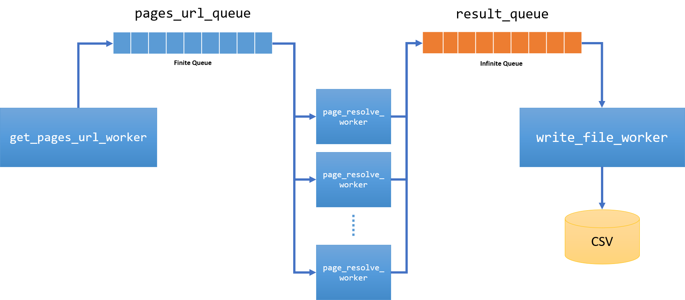

# Práctica 1: Web scraping

## Descripción
Un dataset sobre **los pisos que están en alquiler en barcelona**, aunque el scraper está diseñado para poder recuperar otra ciudad cambiando la variable **city_name = 'barcelona'** en el main, también se puede recuperar datos de pisos en venta cambiando **search_type=sale**  en el main.

## Miembro del equipo
- Daria Gracheva 
- Zechao Jin

## Cómo ejecutar
1. Tener python 3
2. Instala librería con: **pip install -r requirements.txt**
3. Ejecuta el comando **python main.py**

## Estructura del programa
- **get_pages_url_worker** se encarga de recuperar url de cada piso y guarda en la cola **pages_url_queue** para ser tratado
- Unos workers **page_resolve_worker** encargan de traer datos de cada página, el resultado se guarda en otra cola **result_queue**
- **write_file_worker** se encarga de escribir los datos en el archivo dataset.csv

En la siguiente figura muestra el flujo de nuestro web scraper concurrente usando multithreding y colas.

## Estructura de dataset

- **price**: precio mensual del alquiler 
- **district**: barrio donde se encuentra la vivienda
- **area**: superficie de la vivienda
- **room_num**: número de habitaciones
- **bath_num**: numero de baños
- **furnished**: amueblamiento del piso
- **has_parking**:si hay plaza de aparcamiento incluida en el alquiler
- **has_elevator**:si la comunidad dispone de un ascensor
- **has_air**:si hay aire acondicionado
- **distributions_detail**:Información adicional sobre la distribución de la casa que podría
afectar el precio, como por ejemplo,sí tiene lavadero, sí tiene terraza,el estado de la
cocina, etc.
- **features_detail**:Información adicional sobre la característica del piso que puede afectar
el precio, como por ejemplo, el piso que está, el año de construcción, si tiene buena
vista, etc.
- **name**: título del anuncio
- **description**: descripción proporcionada por el anunciante
